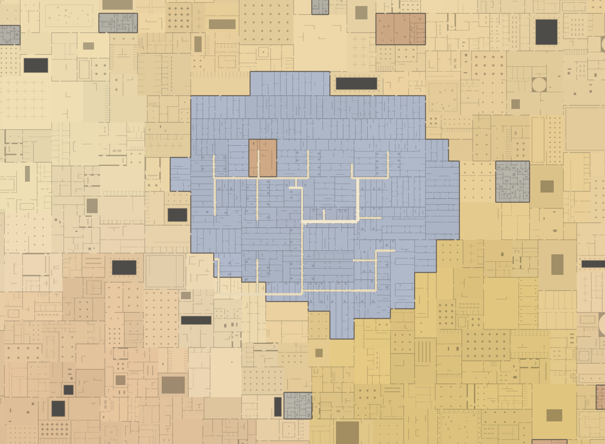
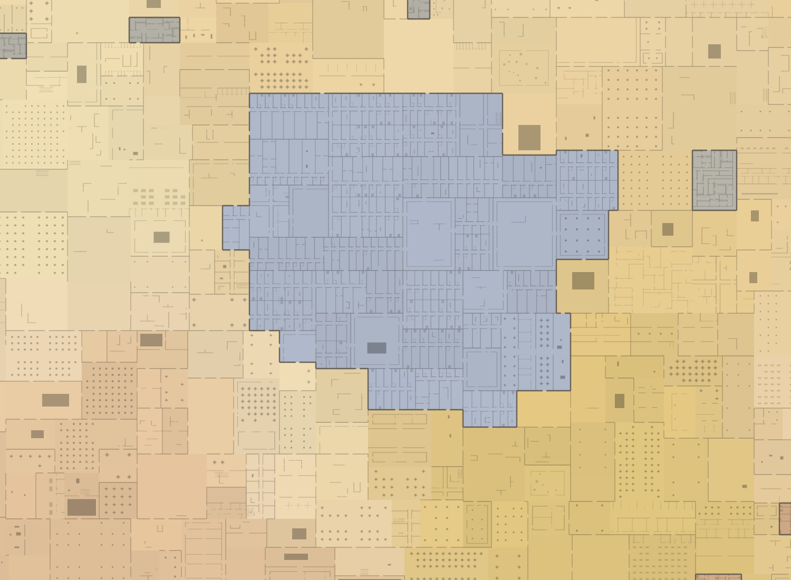
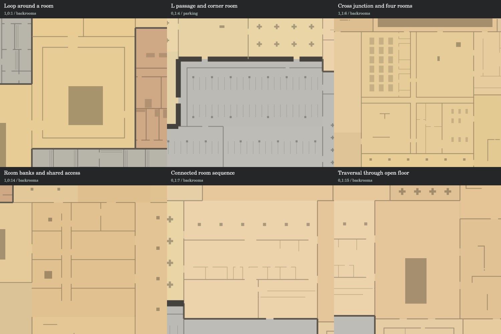
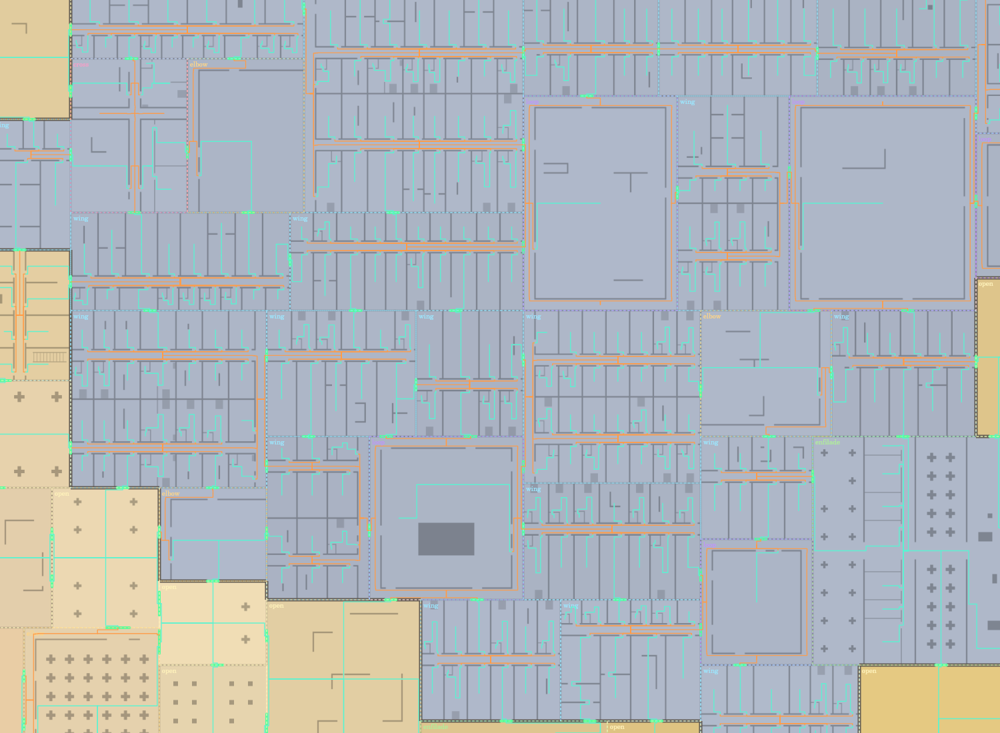
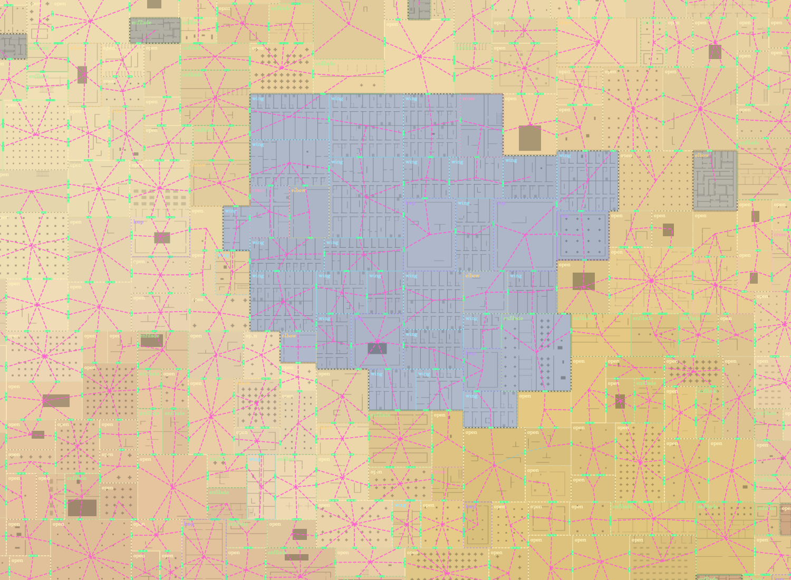
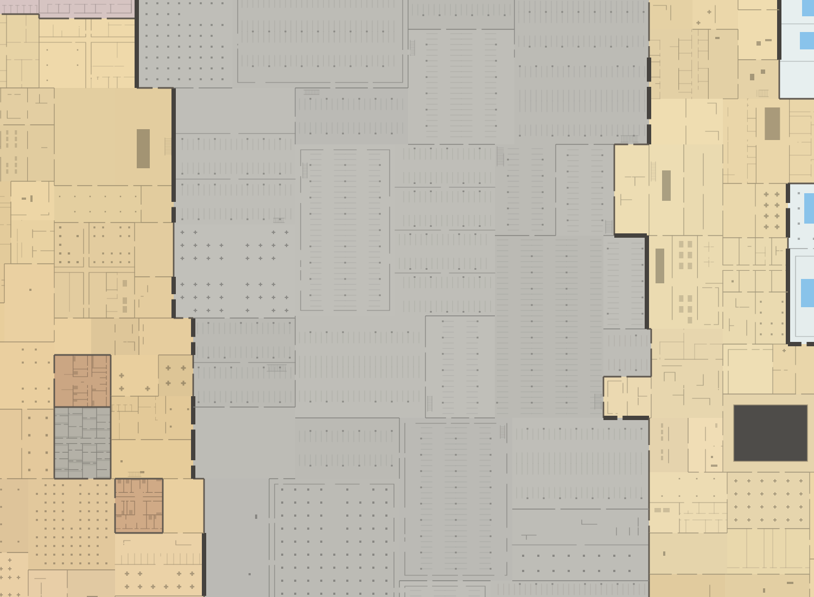

# Architectural pattern rework

The previous implementation turned every global route edge into a permanent
empty corridor. Rooms were generated from leftover rectangles. This rework
plans circulation and room envelopes together inside reusable architectural
pieces, then connects their specified entrances.

## Matched before and after

Both captures use seed `31337`, centre `(678.3766666622831, 443.27501942822704)`,
zoom `3`, and a `1500 × 1100` viewport. The baseline is merged PR #6 at
`cfc87758dd9b5124ebf3d75057f180fc1fe20c8d`. Both use the production tiled Canvas
renderer. Hotel ownership dimensions also change in the rework.

Before:

After:

## The implemented patterns

These are generated world samples, not diagrams or manually placed assets.
The sample territory IDs and precise views are recorded in
[pattern-review-views.json](pattern-review-views.json).

- **Loop:** four connected corridor sides enclosing a procedurally filled core.
- **Elbow:** an L passage with a corner room.
- **Cross:** five connected junction/arm volumes and four room envelopes.
- **Wing:** room banks with entrances facing shared access. Deep envelopes are
  divided into connected wings so room depths remain useful.
- **Enfilade:** connected room sequence with no separately carved corridor.
- **Open:** floor traversal around the contents of an open room.

The same catalogue operates in substrate, districts and pockets. Area profiles
supply weights and dimensions. Shared architectural DNA and structural roles
coordinate family preference, orientation, module, and local variation. Suitable
external entrances influence wing alignment before room infill.

## Global routes and visible corridors

The global graph comprises neighboring pieces and their selected shared ports.
Each piece has a connected local graph of spaces, doors and room traversal.
A global connection does not reserve a line-shaped footprint across the world.

The final architecture uses its area's floor colours for every space, including
appropriate corridors. Only debug mode displays routes:

Orange lines are traversal in pattern-created corridors. Green lines traverse
room floor and connect actual doorways; they are not additional corridor walls
or floor strips. The required walking clearance removes conflicting detail
while permanent solids, pools and voids remain obstacles around which paths run.

Pink/cyan dashed connections show the global graph. These lines have no physical
floor reservation. Green marks show the actual shared entrance apertures.

Parking remains open bay/column/aisle architecture. It no longer has a foreign
pale corridor network superimposed through the region.

## Entrances and infill

Canonical pair contracts establish entrance location, width and orientation
before either interior is generated. Pattern-owned room interfaces are also
planned before infill. The selected room generator must realize those access
points with doorable floor and connected internal rooms.

Permanent obstacles are expanded for clearance and subtracted from a temporary
navigation representation of each room. A bounded rectangle-adjacency search
connects its specified access points through the remaining floor. These
navigation rectangles do not become architectural walls or parcels. Furniture,
columns and decorative partitions are kept clear of the resulting traversal.

Narrow fragments at the end of an aperture receive protected floor, while an
adjacent player-width fragment carries the crossing. Room-bank cuts intersecting
an entrance receive a protected approach recess. No shared port is moved during
boundary realization.

An invalid infill is retried up to four times. Exhaustion produces an explicit
safe open realization of the same envelope, preserving its entrances. Pattern
complexity overflow throws an explicit failure; it cannot silently omit floor.

## Validation

`node tests/run-all.js` passes all ten canonical generation suite runs and the
HTML controller checks.

Reachability queries cover `[-900, -900, 900, 900]`; rooms in the central
`[-800, -800, 800, 800]` envelope must belong to the largest component, excluding
components truncated by the finite query boundary. Physical traversal checks
cover territories intersecting `[-500, -500, 1000, 1000]`.

| Seed | Reachability sample rooms | Unreachable interior rooms | Traversal paths | Traversal segments | Solid/wall intersections |
|---|---:|---:|---:|---:|---:|
| 31337 | 17,815 | 0 | 35,131 | 110,163 | 0 |
| 7 | 21,027 | 0 | 41,767 | 129,612 | 0 |
| 12345 | 21,744 | 0 | 40,522 | 123,953 | 0 |
| 99 | 19,874 | 0 | 37,459 | 115,952 | 0 |
| 4242 | 22,023 | 0 | 38,499 | 118,350 | 0 |

Every tested entrance has matching specifications and complete doorable floor.
There are zero boundary realization failures and zero exhausted infill fallbacks
in the canonical samples. Every local room belongs to its piece's connected
traversal graph. All six patterns occur in multiple semantic areas in each seed.

The suite also verifies exact nonoverlapping ownership and architectural floor
coverage, exact segment coverage by room rectangles, 0.6 m player clearance,
physically sealed infill rejection, profile reuse outside its original semantic
area, explicit block-cap failure, request/load order, cache churn, tiled queries,
far negative coordinates, manifestation diversity, and pocket access.

The production renderer completed overview, close-up, parking, substrate,
pattern atlas, global graph and actual traversal captures. Debug toggles restore
byte-identical final-view pixels. The controller harness executes the actual
HTML script and checks all presets, toggles, hover, seed, zoom, coordinates and
URL serialization. Chromium installation failed in the execution environment;
browser-engine interactions were not verified.

## Review coordinates

Use seed `31337` on the PR build:

| View | Centre | Zoom | Debug options |
|---|---|---:|---|
| Hotel overview | `678.4, 443.3` | 3 | Final architecture |
| Hotel detail | `678, 443` | 9 | Final architecture |
| Actual paths | `678, 443` | 7 | Traversal paths, shared entrances, patterns |
| Global graph | `678, 443` | 3 | Abstract connections, shared entrances, patterns |
| Parking | `480.4, -68.1` | 4 | Final architecture |
| Substrate | `0, 0` | 5 | Final architecture |

## Scope and remaining limits

The route planner, residual parcel planner, interior orchestration, boundary
reconciliation and debugger are replaced. Existing deterministic ownership,
manifestations, semantic vocabulary, bounded bypass rules, zone generators and
tile rendering are reused. Hotel piece proportions are revised.

Rectilinear ownership envelopes still bound architectural pieces. Shared DNA
coordinates neighboring vocabulary and orientation; this is not an unrestricted
multi-piece scene solver. Six reusable patterns and procedural infill provide
the current composition vocabulary. New profile families can extend it.
Rounded-room infill is rejected by the present rectilinear traversal solver.
Vertical connections remain decorative. Tests establish geometric/connectivity
invariants and sampled coverage; screenshots provide the visual review evidence.
