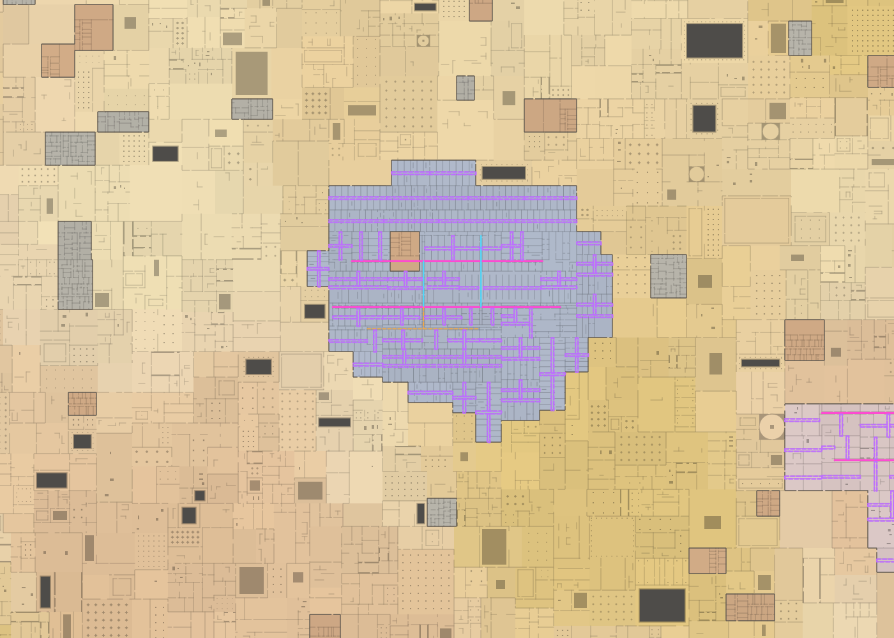
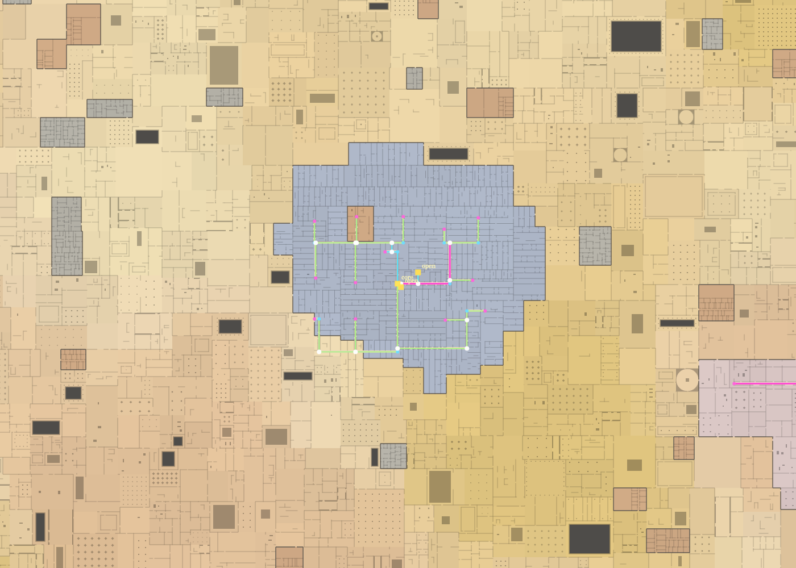
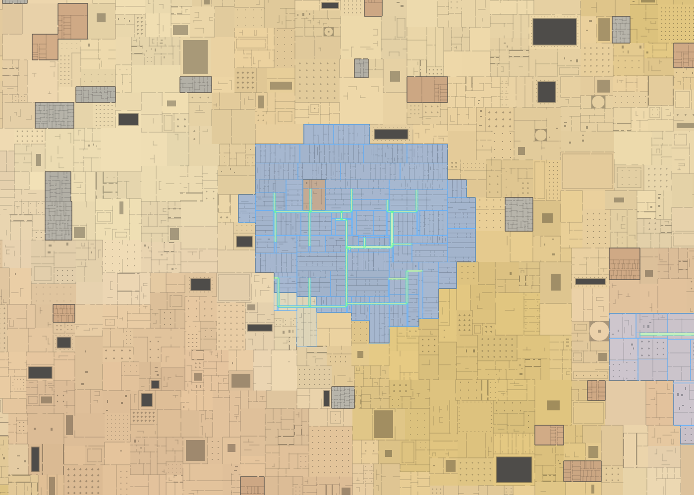
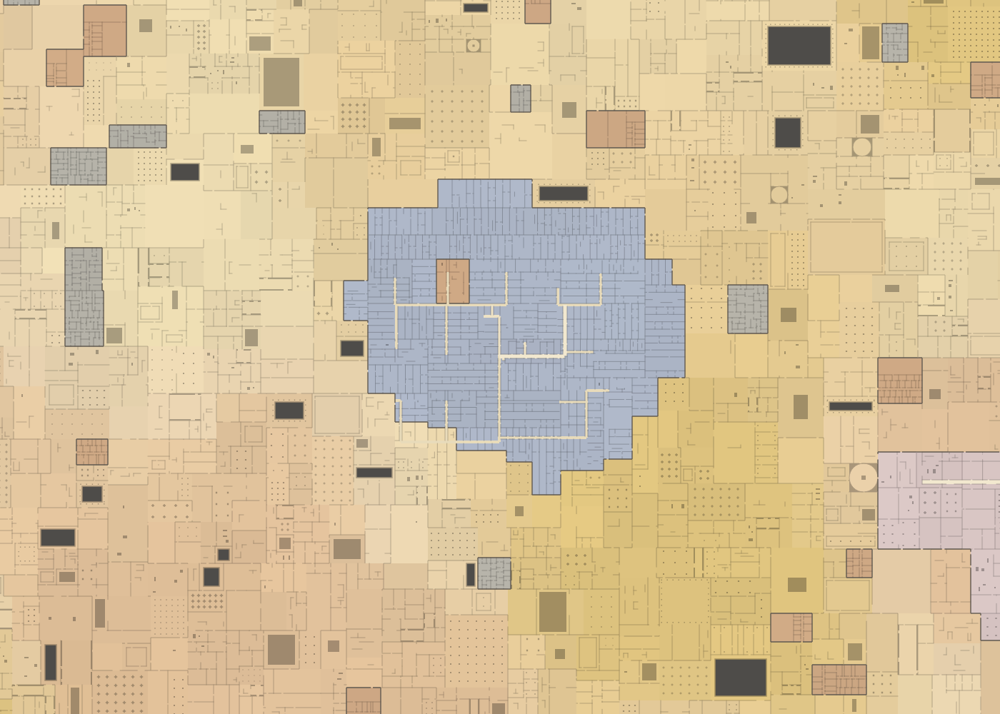

> Historical PR #6 design. The current generator replaces physical global route reservations with [architectural patterns and shared entrances](ARCHITECTURAL_PATTERNS.md).

# World-space circulation milestone

Circulation now owns architectural space before territory interiors are built.
Primary, secondary, local and service paths share one deterministic world-space
network. Technical territory rectangles only clip that space for ownership.

## Concrete behavior change

Previously, major paths were clipped to their semantic manifestation and could
bend inside individual territory rectangles. Residual floor also created local
roots and branches independently in every territory. The resulting route layout
exposed those rectangles.

The new planner never reads territories or interiors. Structural roles choose
destinations and access-depth demands from architectural lobes. All paths have
stable IDs and canonical physical footprints. Every intersecting territory
reserves them, including foreign semantic areas and substrate between lobes.

Territory generation subtracts route space, derives buildable floor and valid
frontage parcels, then selects room archetypes. It creates zero local hallway
rectangles. Deep or unserved floor remains support architecture. Parcel-cap
overflow remains explicitly covered; it cannot disappear from the floor plan.

Matching route space opens technical seams regardless of area identity, DNA,
wall policy or route direction. A seam cutting along a corridor is handled like
a seam cutting across it. Route intersections and turns remain continuous floor.

## Reproduce the review views

Open `index.html`, use seed **31337**, set coordinates to **678.38, 443.28**,
and zoom to **2 px/m**. This compact Hotel manifestation is useful because the
previous generator created many separate access rectangles inside the same
architectural footprint.

The images below use the actual map renderer at identical coordinates, scale
and viewport. The baseline comes from commit
`c9d07c516bec9d786940f564c3ecaf0025ed4a2a`. Overlays are disabled in the final view.

### Previous circulation

Purple territory-local access strips repeatedly reveal ownership rectangles.



### World route network

Pink primary, cyan secondary, green local and orange service paths are selected
from structural roles and world access demands. Local paths can span multiple
territories. Select **World route network** in the debugger.



### Physical reservations and buildable floor

Green route reservations exist before rooms. Blue residual rectangles are
buildable floor after subtraction. Select **Remaining buildable space**.



### Final architecture

The same reservations become continuous corridor floor with interiors arranged
beside them. Select **Final architecture**.



## Validation

Run the complete dependency-free suite:

```sh
node tests/run-all.js
```

Both suites pass for seeds **31337, 7, 12345, 99 and 4242**.

| Seed | Route intersections in the 3.2 km structure sample | Adapted / failed intersections | Rooms in the 1.8 km reachability sample | Unreachable rooms |
| --- | ---: | ---: | ---: | ---: |
| 31337 | 1,709 | 0 / 0 | 30,649 | 0 |
| 7 | 1,723 | 0 / 0 | 33,582 | 0 |
| 12345 | 1,490 | 0 / 0 | 30,833 | 0 |
| 99 | 1,650 | 0 / 0 | 33,369 | 0 |
| 4242 | 1,679 | 0 / 0 | 32,585 | 0 |

For comparison, the baseline seed 31337 structure sample had 38 adapted and 43
failed intersections out of 854 obligations.

The focused circulation suite additionally checks:

- Planning succeeds with territory and interior queries disabled.
- All four hierarchy levels exist, and local paths have world demand provenance.
- Physical footprints are exact in every intersecting territory.
- Ordinary rooms, walls, solids, voids, pools, props and columns avoid route space.
- Routes keep identity across three or more territories and semantic boundaries.
- Seam slices parallel to routes remain open with real room-graph links.
- Reordered, tiled and tiny-cache queries reproduce the canonical network,
  including at far negative coordinates.
- Saturating the parcel budget preserves all floor area without overlap.

The existing suite retains manifestation diversity, program/DNA determinism,
tiling, pocket access, removed Maintenance bands, archetype geometry constraints,
zero door failures and room reachability. Service regions may already lie on an
existing path; they do not require an unnecessary dedicated service corridor.

Visual checks exercised the final map, world network and reservations at the
same coordinates, plus a fragmented manifestation near **-1658.41, -963.40**.
These images were rendered through the production canvas code. Browser
interaction was not tested in this environment.

## Runtime bounds and remaining limits

Each network is bounded to 96 segments, 24 local paths and 80 demand sites.
Each owned rectangle has at most 64 semantic parcels; remaining floor is
explicit support geometry. Networks use existing bounded caches and the
manifestation coordinate halo. No global exploration, simulation, floor flood
fill, generation-order dependency or retry-until-valid loop is introduced.

Access demand uses bounded spatial samples, rather than an exhaustive depth
solver. Unserved or cap-limited residuals become support floor. This milestone
preserves rectilinear semantic ownership boundaries and the existing room-graph
connections between manifestations. It does not add vertical traversal or props.
